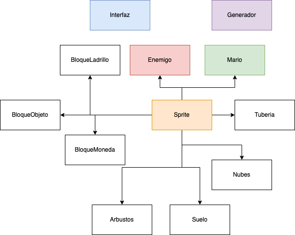

# Super Mario Bros Revisited

## Table of Contents

- [Summary](#summary)
- [Design of Classes (OOP)](#design-of-classes-oop)
- [Algorithms used](#algorithms-used)
- [Included functionality](#included-functionality)
- [Conclusions](#conclusions)

## Summary

This project is a recreation of the first level of Super Mario Bros (original NES video game). It has been developed using a retro game engine called Pyxel. In this report, the operation of the code is collected in a simplified way and a brief reflection on the difficulties encountered when carrying out the project.

## Design of Classes (OOP)

- Sprite: main class inherited by all graphical objects in the game
  - Attributes: used to load in Pyxel the sprite of each object
    - Self.x
    - Self.y
    - Self.img_bank
    - Self.u
    - Self.v
    - Self.w
    - Self.h
    - Self.colkey (transparent color)
  - Methods:
    - draw(): used to simplify code and to display the object
    - check_collision(): used to see if said object collides with others. Returns the colliding object and the colliding side of the object with it

- Static objects (not colored in the diagram) all have the same structure:
inherit the Sprite object and are initialized, changing only their UV (location of
the image of the object in the image bank)

- Mario: class in charge of controlling the main character of the game:
  - Unique attributes:
    - Self.lives
    - Attributes used for Mario's movement:
      - Self.jump_time
      - Self.jump_active
      - Self.grounded
  - Methods:
    - move(): controls Mario's horizontal movement and jump

- Enemy: class that generates the enemies of the game randomly:
  - Unique attributes:
    - Self.enemies[]: a main class generates and saves as an attribute a
    enemy list
    - Self.direction: indicates if the enemy should be directed to the left or
    right
  - Methods:
    - move(): handles the movement of all living enemies in the level
    - spawn_enemies(): constantly called to spawn enemies
    in the passage of time

- Interface: special class that takes care of the score, the coins and the remaining time
of the game, and prints it on the screen.
  - Attributes:
    - Self.score
    - Self.time
    - Self.coins
    - Self.counter (used to calculate elapsed time)
  - Methods:
    - draw(): used to draw the interface on the screen
    - check_time(): called constantly to update the remaining time and take a life from Mario if it reaches 0 (or close the game if there are no lives left).

- Generator: helper class used to generate lists of all static objects in the game. It greatly simplifies the code:
  - No attributes.
  - Methods:
    - Generate_objects (needs as input a list of coordinates of the
      object to generate it)
    - Draw_objects

A file of constants is also used, where all the positions of each static object in the game are located, constants for the interface, the movements of the characters and the physics of the game, the resolution of the screen, the frames per second, etc.

## Algorithms used

The only remarkable algorithm is the collision algorithm. An AABB (Axis-Aligned Bounding Box) collision method has been used, which treats objects as boxes or rectangles, and checks the X and Y axes for collisions.

## Included functionality

- Graphic interface
- Mario's remaining time and lives
- Mario movement with animations
- Random generation of enemies with animations
- Environment decoration
- Limited interaction with blocks
- Collisions of Mario and enemies with static objects

## Conclusions

The project has been difficult in certain aspects, such as collisions, which has been the problem that has taken the longest to implement, and has been partially resolved, since the game has some bugs related to vertical collisions. Another minor issue, which was quickly fixed, was the camera panning around the level.

A video game as a final project is a perfect option to put object-oriented programming concepts into practice, but it is a very complicated task (video game programming is one of the most complex there is) and the Pyxel engine has certain limitations. Even so, it has served as a learning experience for me.
